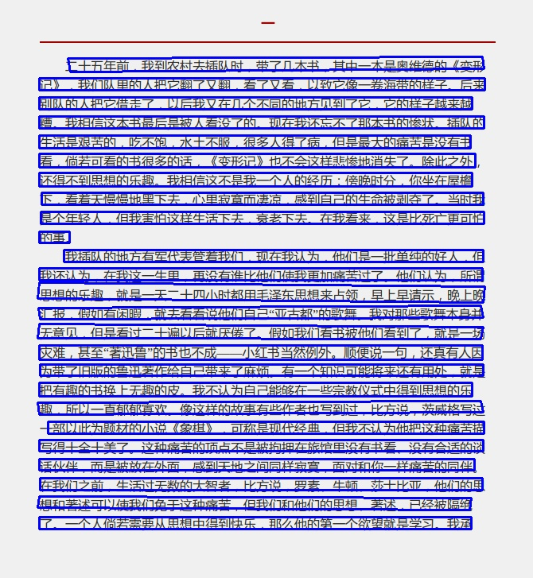
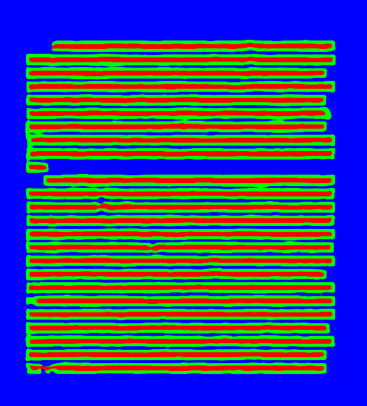

# tf-sotd
tensorflow version "Self-organized Text Detection with Minimal Post-processing via Border Learning"
<<<<<<< HEAD

### feature
- support [x1, y1, x2, y2, x3, y3, x4, y4] format label
- integrate into east
- multitask training with east and sotd

### Usage

1. Downloads Resnet_v1 from [here](http://download.tensorflow.org/models/resnet_v1_50_2016_08_28.tar.gz)
2. Organize your dataset
3. train:
`./train.sh`
4. test:
```
./test_single_img.sh
```

### Some Results
I train the model on my diy-dataset, and I test it on crowd text, here is a sample result from "沉默的大多数"



### References
- [EAST](https://github.com/argman/EAST)
- [sotd-keras-theano-version](https://gitlab.com/rex-yue-wu/ISI-PPT-Text-Detector)

